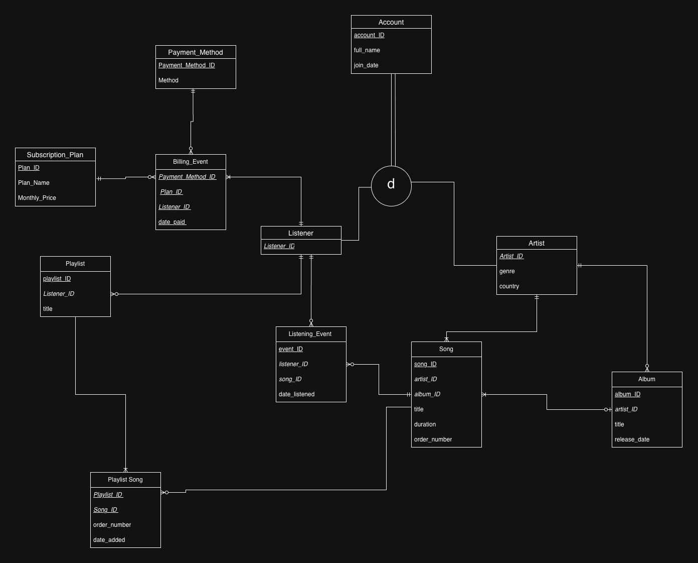
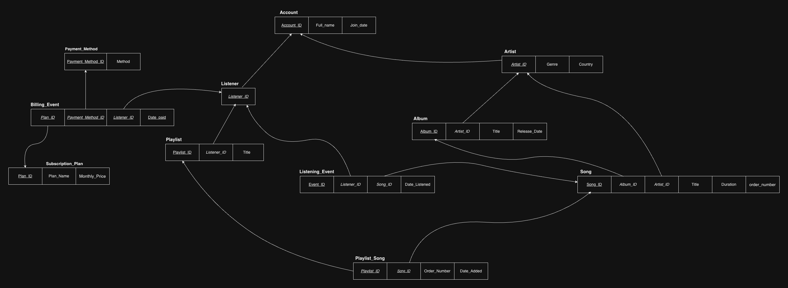
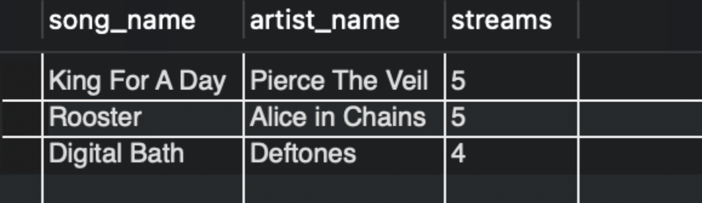
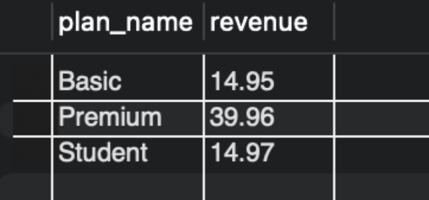
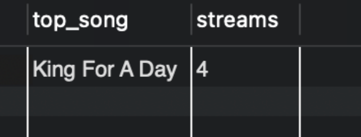
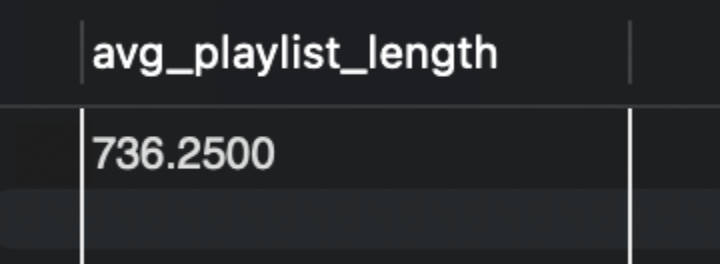

# <p align="center">🎧 Music Streaming Database & Analysis 🎧</p>

## 📌 Overview
This project is a relational database designed to simulate a Spotify-like system. It stores and analyzes data related to users, artists, songs, and listening behavior.
The goal of this project was to design a well-structured database from scratch and use SQL queries to extract meaningful insights from the data.

## 🛠️ Technologies and Principles Used
* SQL (MySQL)
* Normalization
* Primary/foreign keys
* Complex Queries

## 📊Schema Diagrams
Primary keys are underlined and foreign keys are italicized.

### Entity Relationships


### Third Normal Form


## 🧱 Database Implementation
The full database implementation schema can be found here:
* [schema.sql](schema.sql)

This implementation includes:

* Logical relationships modeled to reflect real-world interactions within a music streaming platform
* Use of primary keys to uniquely identify each record  
* Use of foreign keys to enforce relationships between tables  
* Application of normalization principles to reduce redundancy and improve data integrity  
* Appropriate data types selected for efficient storage and querying  
* Junction tables to handle many-to-many relationships

The schema was designed to support complex queries involving joins, aggregations, and filtering across multiple entities.

## 🔍Queries & Analysis
The queries used to analyze the data can be found here:
* [queries.sql](queries.sql)

This file includes SQL queries that demonstrate:

* Use of JOIN operations to combine data across multiple related tables  
* Application of aggregate functions (COUNT, AVG, etc.) to summarize data  
* Use of GROUP BY and ORDER BY to organize and rank results
* Filtering data using WHERE clauses for more targeted insights  
* Analysis of user behavior and music trends through structured queries  
* Use of subqueries to perform more advanced data retrieval

### Example Insights

#### 1. Find the titles, artists and number of streams of the top 3 most streamed songs
```mysql
SELECT title as song_name,
account.full_name as artist_name,
 COUNT(listening_event.song_id) as streams
FROM account, artist, song, listening_event
WHERE account.account_id = artist.artist_id
AND artist.artist_id = song.artist_id
AND song.song_id = listening_event.song_id
GROUP BY song.song_id, song.title, account.full_name
ORDER BY streams DESC
LIMIT 3
```



#### 2. Find the total revenue generated by each subscription plan

```mysql
SELECT subscription_plan.plan_name,
COUNT(billing_event.plan_id) * subscription_plan.monthly_price AS revenue
FROM subscription_plan, billing_event
WHERE subscription_plan.plan_id = billing_event.plan_id
GROUP BY subscription_plan.plan_id;
```


#### 3.Find the name and number of streams for the most listened to song for the user named ‘Ambrosia Lock’

```mysql
SELECT title AS top_song,
count(title) AS streams
FROM account, listener, listening_event, song
WHERE account.full_name = 'Ambrosia Lock'
AND account.account_id = listener.listener_id
AND listener.listener_id = listening_event.listener_id
AND listening_event.song_id = song.song_id
GROUP BY song.song_id
ORDER BY streams DESC
LIMIT 1;
```


#### 4. Find the average length of playlists on the platform

```mysql
SELECT AVG(playlist_length) AS avg_playlist_length
FROM (
SELECT SUM(song.duration) AS playlist_length
FROM playlist, playlist_song, song
WHERE playlist.playlist_id = playlist_song.playlist_id
AND playlist_song.song_id = song.song_id
GROUP BY playlist.playlist_id
) AS sub;
```


#### Overall these queries reflect real-world use cases such as identifying popular content, analyzing user engagement, and uncovering trends within a music streaming platform.

## 💭 Conclusion
I chose this topic because I have a strong interest in large scale platforms that generate substantial amounts of data. I am specifically intrested in the way that this data is stored, handled, and utilized to improve the users experience. 

Through this project, I learned:
* How to design a database from scratch
* The importance of normalization and efficient schema design
* How to write complex SQL queries using joins and aggregations
* How databases are used to support real-world applications
